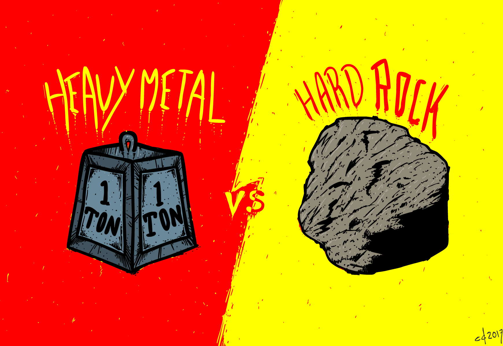

```{r, warning=FALSE, message=FALSE,echo=FALSE}
knitr::opts_chunk$set(echo = FALSE,warning=FALSE, message=FALSE)
```


```{r, eval = FALSE}
packages.used=c("tm", "tidytext","tidyverse","DT","wordcloud","scales","gridExtra","ngram","igraph","ggraph","rsconnect", "reshape2", "ggmosaic","fmsb","topicmodels")
# check packages that need to be installed.
packages.needed=setdiff(packages.used, 
                        intersect(installed.packages()[,1], 
                                  packages.used))
# install additional packages
if(length(packages.needed)>0){
  install.packages(packages.needed, dependencies = TRUE)
}
```

```{r}
# load packages
library(tm)
library(tidytext)
library(tidyverse)
library(DT)
library(wordcloud)
library(scales)
library(gridExtra)
library(ngram)
library(igraph)
library(ggraph)
library(rsconnect)
library(reshape2)
library(ggmosaic)
library(textdata)
library(fmsb)
library(topicmodels)
```




When I explore the data, Metal music quickly catches my eyes. While all other genres use "love" most frequently, Metal music writes more about "time" and "life". I am curious about this type of music and did some research on that. To my surprise, it is a subgenre of rock music. However, in our dataset, these two types of music are well separated. Therefore, I want to explore how Metal is different from regular Rock music.

This report is prepared with the following environmental settings.
```{r}
print(R.version)
```

First, I run the 'Text_Processing.Rmd' to clean the data. The procedure includes converting all the letters to the lower case, removing punctuation, numbers, empty words and extra white space, reducing words to their own stems, and resembling the structure of the original lyrics. The cleaned data is saved in the output folder as "processed_lyrics.RData".

Then, I combine the processed_lyrics.RData with "artists.csv" which contains the artists information. 

We are ready to go!


```{r load data, warning=FALSE, message=FALSE}
# load lyrics data
load('../output/processed_lyrics.RData') 
# load artist information
dt_artist <- read.csv('../data/artists.csv') 
```

```{r join data}
dt_lyrics <- dt_lyrics %>%
  left_join(dt_artist, by = c("artist" = "Artist"))
```

### Part I: Differences Between Metal and Rock on Word Choice

In the first part, I want to explore the difference between lyrics according to frequently used words. 

```{r Metal vs. Rock}
Metal<-dt_lyrics[dt_lyrics$genre=="Metal",]
Rock<-dt_lyrics[dt_lyrics$genre=="Rock", ]
```

```{r wordcloud Metal}
bag_of_words_Metal<- Metal %>% 
  unnest_tokens(words, stemmedwords)

word_count_Metal <- bag_of_words_Metal %>%
  count(words, sort = TRUE)

wordcloud(word_count_Metal$words,word_count_Metal$n, 
          max.words=100, 
          colors = brewer.pal(9,"BuGn"),
          main="Wordcloud for Metal lyrics")
```

For Metal lyrics, "time" and "life" stand out. Besides that, we can see "die" "world", "blood" etc are also used frequently, which shows a dark and depressing atmosphere. 

```{r wordcloud Rock}
bag_of_words_Rock<- Rock %>% 
  unnest_tokens(words, stemmedwords)

word_count_Rock <- bag_of_words_Rock %>%
  count(words, sort = TRUE)

wordcloud(word_count_Rock$words,word_count_Rock$n, 
          max.words=100, 
          colors = brewer.pal(9,"Reds"), 
          main="Wordcloud for Rock lyrics")
```

For Rock lyrics, "love", "time" and "youre" are the top 3 highest frequency words. Most words that stand out are more relax than the Metal lyrics. For instance, "baby", "day", and etc.


```{r}
p1<-word_count_Metal[1:15,] %>%
      mutate(words = reorder(words, n)) %>%
      ggplot(aes(words, n)) +
      geom_col(fill="palegreen2") +
      labs(title = " Word Frequency for Metal Music")+
      xlab(NULL) +
      ylab("Word Frequency")+
      coord_flip()+ theme_bw()
```


```{r}
p2<-word_count_Rock[1:15,] %>%
      mutate(words = reorder(words, n)) %>%
      ggplot(aes(words, n)) +
      geom_col(fill="tomato2") +
      labs(title = " Word Frequency for Rock Music")+
      xlab(NULL) +
      ylab("Word Frequency")+
      coord_flip()+ theme_bw()
grid.arrange(p1, p2, nrow = 1)
```

Then I take a closer look at the summary of the frequently used words for both genres. The top 5 words for Mental are different from Rock, suggesting that they may show different sentiments/topics. Also, by looking at 10-15 of both genres, we get some sense of what they are trying to express. In particular, Metal uses more aggressive words but Rock has more relax words.

Next, I try to visualize word in pairs, it help us see the connection between words.

```{r bigrams for Metal}
Metal_bigrams <- Metal %>%
  mutate(count = sapply(Metal$stemmedwords, wordcount)) %>%
  filter(count != 1) %>%
  unnest_tokens(bigram, stemmedwords, token = "ngrams", n = 2)

Metal_bigram_counts <- Metal_bigrams %>%
  separate(bigram, c("word1", "word2"), sep = " ") %>%
  count(word1, word2, sort = TRUE)

Metal_bigram_graph <- Metal_bigram_counts %>%
  filter(n > 100) %>%
  graph_from_data_frame()
    
x <- grid::arrow(type = "closed", length = unit(.1, "inches"))
ggraph(Metal_bigram_graph, layout = "fr") +
  geom_edge_link(aes(edge_alpha = n), show.legend = FALSE,
                     arrow = x, end_cap = circle(.05, 'inches')) +
  geom_node_point(color = "lightgreen", size = 3) +
  geom_node_text(aes(label = name), repel = TRUE) +
  theme_void()
```

The plot above is the common bigram for Metal lyrics. There is one cluster focused on "life". It connects with "death" and "live". Besides that, it is hard to see any other obvious clusters. The information we can get is limited. 

```{r bigrams for Rock}
Rock_bigrams <- Rock %>%
  mutate(count = sapply(Rock$stemmedwords, wordcount)) %>%
  filter(count != 1) %>%
  unnest_tokens(bigram, stemmedwords, token = "ngrams", n = 2)

Rock_bigram_counts <- Rock_bigrams %>%
  separate(bigram, c("word1", "word2"), sep = " ") %>%
  count(word1, word2, sort = TRUE)

Rock_bigram_graph <- Rock_bigram_counts %>%
  filter(n > 600) %>%
  graph_from_data_frame()
    
x <- grid::arrow(type = "closed", length = unit(.1, "inches"))
ggraph(Rock_bigram_graph, layout = "fr") +
  geom_edge_link(aes(edge_alpha = n), show.legend = FALSE,
                     arrow = x, end_cap = circle(.05, 'inches')) +
  geom_node_point(color = "tomato2", size = 3) +
  geom_node_text(aes(label = name), repel = TRUE) +
  theme_void()

```

For Rock, "love" an obvious center, and the words connect to it are "baby", "girl" and etc. Another cluster connects to it focused on "heart". Therefore, Rock may have some relax or sad love song. 

With a single word or bigram analysis, we can roughly tell the emotion or topic that each genre is trying to express. To be more accurate, we continue to evaluate the sentiment. 


### Part II: Differences Between Metal and Rock on Sentiments

By simply looking at the high frequency words and words relation, we may guess the general emotion of each genre. In this section, I am trying to use sentiment analysis to evaluate the sentiments of lyrics to better summarize the characteristic of each genre. 

First, I use bing lexicon which categorizes words in a binary fashion into positive and negative categories. I assign positive or negative sentiment to each word, count which sentiment dominates the lyrics, and assign it to the lyrics. 

```{r sentiment using bing}
Metal_Rock <- bind_rows(
  Metal %>%
    mutate(id = id) %>%
    unnest_tokens(stems, stemmedwords) %>%
    inner_join(get_sentiments("bing"), by = c("stems" = "word")) %>%
    group_by(id) %>%
    count(sentiment) %>%
    summarise(mood = sentiment[which.max(n)])%>%
    inner_join (Metal), 
  Rock %>%
    mutate(id = id) %>%
    unnest_tokens(stems, stemmedwords) %>%
    inner_join(get_sentiments("bing"), by = c("stems" = "word")) %>%
    group_by(id) %>%
    count(sentiment) %>%
    summarise(mood = sentiment[which.max(n)]) %>%
    inner_join (Rock))

ggplot(Metal_Rock) + 
  geom_bar(mapping = aes(x = genre, fill = mood),alpha = 0.5, position = "fill")+
  ylab("Percentage")+
  coord_flip()
```

For both genres, most lyrics are negative. In particular, 90% Metal music is negative, which has a higher rate than negative Rock. 

```{r}
Metal_Rock_Sentiment <- bind_rows(
  Metal %>%
    mutate(id = id) %>%
    unnest_tokens(stems, stemmedwords) %>%
    inner_join(get_sentiments("bing"), by = c("stems" = "word")) %>%
    group_by(id) %>%
    count(stems, id, sentiment) %>%
    spread(sentiment, n, fill = 0) %>%
    mutate(sentiment = positive - negative) %>%
    summarise(sentiment = mean(sentiment), genre="Metal"),
   Rock %>%
    mutate(id = id) %>%
    unnest_tokens(stems, stemmedwords) %>%
    inner_join(get_sentiments("bing"), by = c("stems" = "word")) %>%
    group_by(id) %>%
    count(stems, id, sentiment) %>%
    spread(sentiment, n, fill = 0) %>%
    mutate(sentiment = positive - negative) %>%
    summarise(sentiment = mean(sentiment), genre="Rock")
)

sample_MR<-rbind(Metal_Rock_Sentiment[sample(11281,100),],
                  Metal_Rock_Sentiment[sample(c(11281:75483),100),])

ggplot(sample_MR, aes(as.factor(id), sentiment, fill = genre)) +
  geom_col(show.legend = FALSE) +
  xlab("lyrics (sample)")+
  facet_wrap(~genre, nrow = 2, scales = "free")+
  theme(axis.text.x=element_blank(),axis.ticks.x=element_blank())
```

I randomly sample 100 lyrics for each genre, and plot their "sentiment score" by taking the mean of words' value in the lyrics. Overall, Metal gets less and lower positive scores. 

Then, I try to use nrc lexicon which gives more categories, including anger, anticipation, disgust, fear, joy, sadness, suprise, and trust. 

```{r sentiment comparsion nrc}
Metal_nrc<- Metal %>%
  mutate(id = id) %>%
  unnest_tokens(stems, stemmedwords) %>%
  inner_join(get_sentiments("nrc"), by = c("stems" = "word")) %>%
  filter (sentiment != "positive" & sentiment != "negative") %>%
  group_by(id) %>%
  count(sentiment) %>%
  summarise(mood = sentiment[which.max(n)]) %>%
  inner_join (Metal) 
  

Rock_nrc <- Rock %>%
  mutate(id = id) %>%
  unnest_tokens(stems, stemmedwords) %>%
  inner_join(get_sentiments("nrc"), by = c("stems" = "word")) %>%
  filter (sentiment != "positive" & sentiment != "negative") %>%
  group_by(id) %>%
  count(sentiment) %>%
  summarise(mood = sentiment[which.max(n)]) %>%
  inner_join (Rock) 

sent_summary=rbind(table(Metal_nrc$mood), table(Rock_nrc$mood))
sent_summary_percentage<-rbind(rep(0.5,8), rep(0,8), Metal=sent_summary[1,]/sum(sent_summary[1,]), 
                               Rock=sent_summary[2,]/sum(sent_summary[2,]))


colors_border=c( rgb(0.2,0.5,0.5,0.9), rgb(0.8,0.2,0.5,0.9) )
colors_in=c( rgb(0.2,0.5,0.5,0.4), rgb(0.8,0.2,0.5,0.4) )

radarchart( as.data.frame(sent_summary_percentage),axistype=2, 
    #custom polygon
    pcol=colors_border , pfcol=colors_in , plwd=4 , plty=1,
    #custom the grid
    cglcol="grey", cglty=1, axislabcol="grey", caxislabels=seq(0,20,5), cglwd=0.8,
    #custom labels
    vlcex=0.8 
    )
legend(x=1, y=1, legend = rownames(sent_summary_percentage[-c(1,2),]), bty = "n", pch=20 , col=colors_border , text.col = "black", cex=1, pt.cex=3)
```


To show the proportion of each category in each genre, I use the radar plot. We can see that Metal lyrics show more fear, while Rock music express more joy. 

Next, I calculate the proportion of each category in each year, and draw the heatmaps.

```{r heatmap for Metal by year}
Metal_sent_percentage<-Metal_nrc %>% 
  group_by(year) %>%
  summarise(anger=sum(mood=="anger")/length(id),
            anticipation=sum(mood=="anticipation")/length(id),
            disgust=sum(mood=="disgust")/length(id),
            fear=sum(mood=="fear")/length(id),
            joy=sum(mood=="joy")/length(id),
            sadness=sum(mood=="sadness")/length(id),
            surprise=sum(mood=="surprise")/length(id),
            trust=sum(mood=="trust")/length(id)) %>%
  gather(key="mood", value=percentage, -year)


ggplot(Metal_sent_percentage, aes(x=year,y=mood)) + 
  geom_tile(aes(fill=percentage)) +
  labs(title = " Sentiment Proportion for Metal")+
  scale_fill_gradient(low = "#cccccc", high = "lightgreen") 
```


```{r heatmap for Rock by year}
Rock_sent_percentage<-Rock_nrc %>% 
  group_by(year) %>%
  summarise(anger=sum(mood=="anger")/length(id),
            anticipation=sum(mood=="anticipation")/length(id),
            disgust=sum(mood=="disgust")/length(id),
            fear=sum(mood=="fear")/length(id),
            joy=sum(mood=="joy")/length(id),
            sadness=sum(mood=="sadness")/length(id),
            surprise=sum(mood=="surprise")/length(id),
            trust=sum(mood=="trust")/length(id)) %>%
  gather(key="mood", value=percentage, -year)


ggplot(Rock_sent_percentage[-1,], aes(x=year,y=mood)) + 
  geom_tile(aes(fill=percentage)) +
  labs(title = " Sentiment Proportion for Rock")+
  scale_fill_gradient(low = "#cccccc", high = "tomato2") 
```

For Metal, most lyrics express fear and sadness. In 1995, there is an exception that many lyrics express joy.  

For Rock, most lyrics show joy. Besides that, anticipation, fear, sadness, and trust also takes some proportion. Rock lyrics express various types of sentiments. 


## Part III: What do Metal Artists "Fear" of?

Since most Metal lyrics are negative and express fear, my next step is to figure out what do Metal artists "fear" of? I try to answer this question by looking at all lyrics that express fear and the lyrics that contain fear and trying to find the top 3 topics among those lyrics.

```{r Topic Model about Fear}
Metal_fear<- Metal_nrc[Metal_nrc$mood=="fear" | grepl("fear", Metal_nrc$stemmedwords), ]

fear_word_counts<-Metal_fear %>% 
  unnest_tokens(words, stemmedwords) %>%
  count(id, words, sort = TRUE) %>%
  ungroup()

fear_TM<-fear_word_counts %>%
  cast_dtm(id, words, n)

fear_lda <- LDA(fear_TM, k = 3,  control = list(seed = 1234))
fear_topics <- tidy(fear_lda, matrix="beta")
    
top_terms <- fear_topics %>%
  group_by(topic) %>%
  top_n(10, beta) %>%
  ungroup() %>%
  arrange(topic, -beta)
    
top_terms %>%
  mutate(term = reorder_within(term, beta, topic)) %>%
  group_by(topic, term) %>%    
  arrange(desc(beta)) %>%  
  ungroup() %>%
  ggplot(aes(term, beta, fill = as.factor(topic))) +
  geom_col(show.legend = FALSE) +
  coord_flip() +
  scale_x_reordered() +
  labs(title = "Top 10 terms in each Fear Topic",
       x = NULL, y = expression(beta)) +
  facet_wrap(~ topic, ncol = 2, scales = "free")
```

The first topic contains "kill", "world", "die", "war", and "pain". They might belong to war and kill.

The second topic contains "time", "life", "ill", "eyes", and "inside". They may refer to mental illness.

The third topic includes "blood", "soul", "god". They might be summarized to religious topics. 

Therefore, war, mental illness, and religious topic are three major topics that Metal artists are "fear" of.

## Conclusion

1. By looking at words, Metal lyrics talk more about "life" and "time", while Rock talk more about "love". Some words show darkness and aggressiveness side of Metal lyrics. Some word show relax and sadness aspects of Rock.

2. From the sentiment analysis, we conclude that most Metal lyrics are negative and show fear and sadness, but most Rock show joy. 

3. From topic modeling, the top 3 topics of "fear" for Metal lyrics are war, mental illness, and religion.
